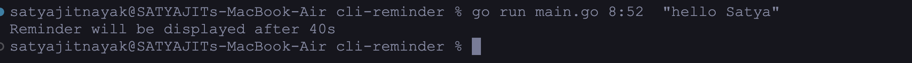
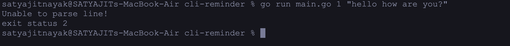
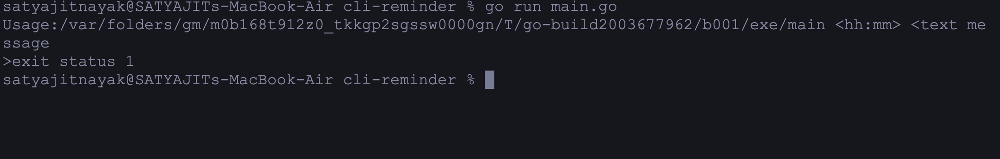
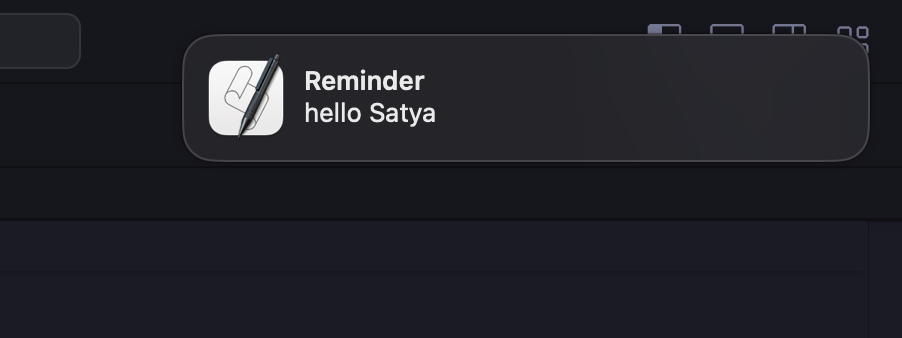
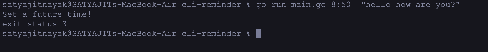

# cli-reminder

## Command-Line Reminder App

The Command-Line Reminder App is a cross-platform reminder application developed in Go (Golang). It provides a simple and efficient way to set, manage, and receive reminders directly from the command line. With its minimalist design, users can seamlessly integrate reminders into their daily workflow, making it a convenient solution for tasks, events, and deadlines.
A cross platform reminder app on command line using go lang.

## Usage

```sh
  run main.go hh:mm <message>
```

## Correct Usage



## Invalid Time



## Invalid Usage



## Reminder



## Set Future Time



## Credits

[beeep](https://github.com/gen2brain/beeep) & [when](https://github.com/olebedev/when) go packages
